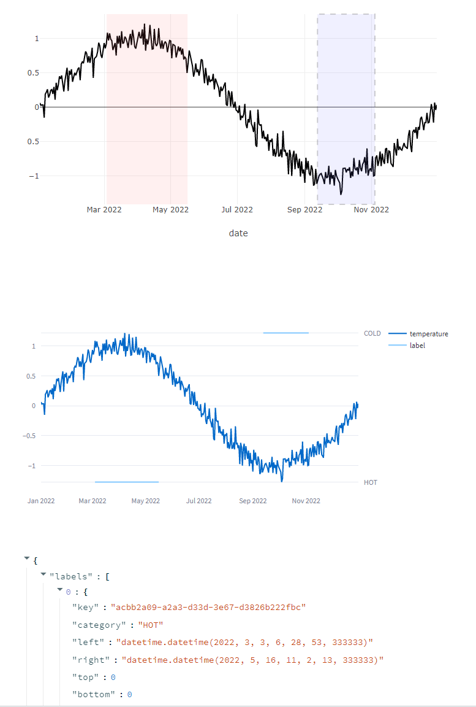

# streamlit-label-graph

Plotly graph for labelling timeserie data

## Installation instructions 

```sh
pip install streamlit-label-graph
```

## Run demo
```sh
python -m streamlit_label_graph
```

## Usage instructions

```python
import plotly.express as px
import pandas as pd
from streamlit_label_graph import label_graph, LabelConfig

config: LabelConfig = {
    'categories': [
        {'key': "HOT", 'color': 'rgba(255 110 110,0.1)'},
        {'key': 'COLD', 'color': "rgba(110,110,255,0.1)"}
    ]
}
df = pd.DataFrame({'date': .., 'temperature': ..})
figure = px.line(df, x=df['date'], y=df['temperature'])
labels = label_graph(figure, config)
# -> [{"key": "..", "category": "HOT", "left": .., "right": ..}, {...}]
```

* Use Ctrl + Mouse-drag to create a new label
* Right click on a label to set the category


